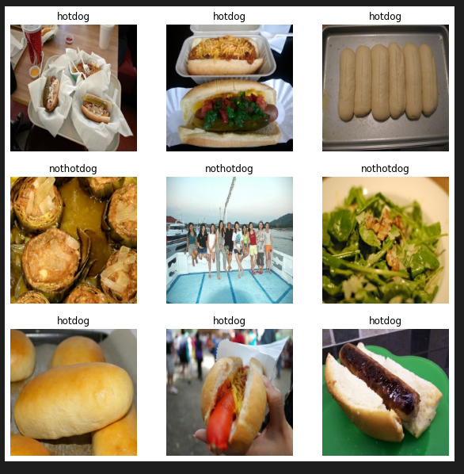
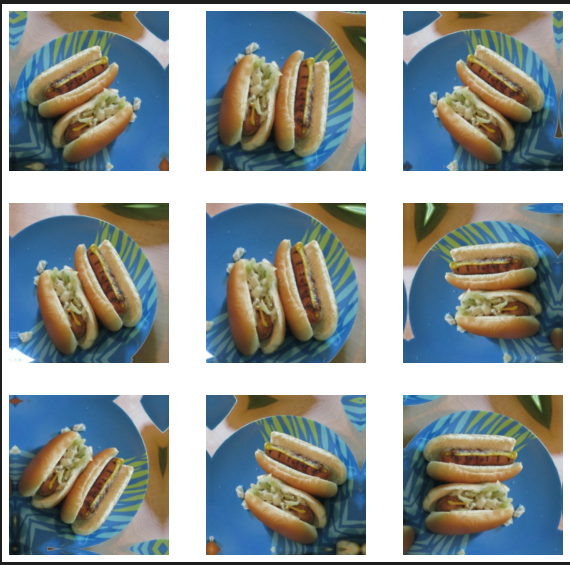
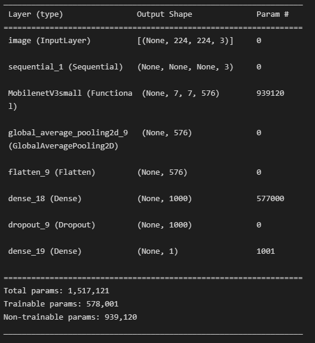
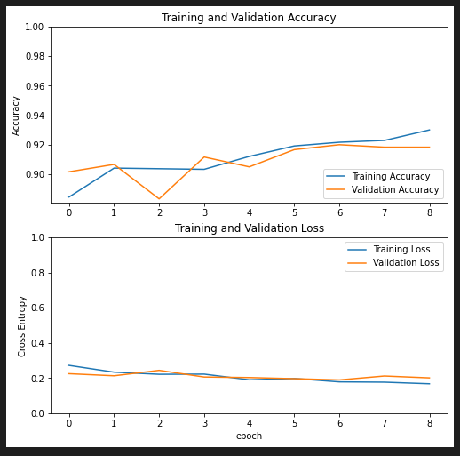

# Hotdog Classifier App
## [Link to Demo Website](https://elliot-chung.github.io/hotdog-classifier-app/)
  
  
## How It's Built
### Version 1
1. Collected 100 images of hotdogs off the internet using [tzutalin's](https://github.com/tzutalin) [labelImg](https://github.com/tzutalin/labelImg) for labelling. 
2. Took advantage of the [TF2 model zoo](https://github.com/tensorflow/models/blob/master/research/object_detection/g3doc/tf2_detection_zoo.md) to perform transfer learning on an image detection CNN model. I trained the model using Google Colab and when finished, I exported the model in the TensorflowJS format. I followed much of this [tutorial](https://github.com/nicknochnack/TFODCourse) from [Nicholas Renotte](https://www.youtube.com/channel/UCHXa4OpASJEwrHrLeIzw7Yg) for this step. 
3. Wrote an express app that uses tfjs-node library to make evaluations using the model on a server. 
4. Deployed the app on Heroku.
5. Wrote a frontend React application to interact with the API.
6. Deployed the frontend app to github pages. 

### Version 2
1. I used [this](https://www.kaggle.com/datasets/yashvrdnjain/hotdognothotdog?resource=download) kaggle dataset rather than try to collect my own.
2. Rewrote the the training notebook to train a new model (details below)
3. No longer using an express server to run evaluations. Instead, a model is served to from Amazon S3 directly to the browser. 

## Improvement to be Made
As it stands, while the model is able to accurately detect the presence of a hotdog it is quite prone to false positives. I'd like to eventually train a new model trying some of the following to increase the model's accuracy.
1. ~~Collect more images of hotdogs.~~
2. ~~Collect random images specifically for a 'not hotdog' label.~~
3. ~~Try transferring from another pre-trained model.~~  

Each of these have been addressed in version 2

## Model Training/Architecture Details
### Example Training Data

### Data Augmentation 
The following shows the results of using Tensorflow's preprocessing layers. Images were randomly flipped, rotated, and zoomed to create more training data.  

### Model Architecture
I made use of the the MobilenetV3 implementation that comes with Tensorflow for transfer learning.

### Training History
The model was trained on google colab. The optimizer used was Adam and the loss function was binary cross-entropy. The training data was batched in groups of 32. The early stopping condition was met at the end of the 9th epoch.  

## Tools
Tensorflow/TensorflowJS  
~~NodeJS~~
~~Express framework~~  
~~Heroku~~  
React  
Amazon S3

## Inspiration
Did I spend actual hours of my life recreating a mid joke from an aging show? Absolutely.   

